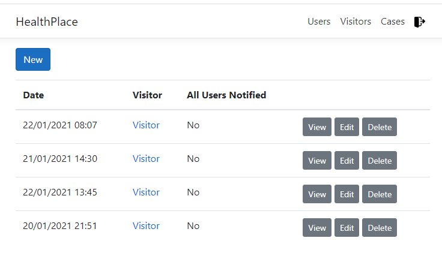

# HealthPlace
HealthPlace is a SPA for containing COVID-19 spread by alerting your customers that they were in close contact with someone infected.

# Motivation
One of the reasons the COVID-19 pandemic is taking over the world is how easy it spreads, containing its spread must be done in every way we can, this app will allow business owners easily contact all their costumers who were in contact at their facilities with someone who is infected with COVID-19.

# Tech/framework used
* .NET Core 3.1
* LiteDB
* ReactJS
* TypeScript

# Authors
* [Rafael Duarte](https://github.com/Duarte10)

# License
This project is licensed under the MIT License - see the [LICENSE](https://github.com/Duarte10/HealthPlace/blob/main/LICENSE) for more details
